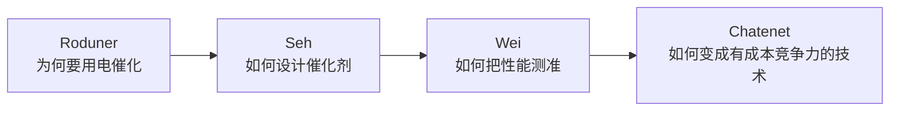

导师方向是电催化 + 生物质转化 + 二维材料。为了建立可反复回看的地图，我把手头四篇必读文献通读了一遍：一篇概念地基、一篇理论设计框架、一篇实验协议、一篇工业与成本全景。这篇是空闲时也能刷完的消化版——不是逐字翻译，而是「读完你应该带走什么」。

<!-- more -->

## 四篇分别在干什么

| 文献 | 角色 | 一句话 |
| --- | --- | --- |
| Roduner, *Catal. Today* 2018 | 概念地基 | 能量转换电化学 ≠ 传统电化学；电极是催化剂 |
| Seh et al., *Science* 2017 | 设计语言 | 描述符 + 火山图 + 标度关系 |
| Wei et al., *Adv. Mater.* 2019 | 测量手册 | 怎么测才可信、才能和别人比 |
| Chatenet et al., *Chem. Soc. Rev.* 2022 | 工业全景 | 五类电解槽、材料、LCOH |

建议顺序就按这个来：概念 → 设计 → 测量 → 器件与成本。

---

## 一、Roduner：先把世界观立住

**高功率必须纳米化。** 现代燃料电池/电解槽工作在 ~1 A cm⁻²。欧姆定律 ΔU = R·i 决定了：要大电流就必须小电阻 → 极间距压到几十微米。聚合物膜 ~50 μm 时，1 A cm⁻² 下压降约 20 mV，仍相当于可用功率的 ~25% 损失。这不是「画得好看」，是架构必然。

**电催化相对热催化的三重优势：**

1. 放热反应能把自由能变成电（H₂ 燃烧约 83% 可转为电能，对应 1.23 V）；
2. 强吸热反应可用电能在近室温进行（电解水室温即可，热分解要 >2000 °C）；
3. 膜分隔让氧化/还原产物分开得到。

**电极不是导电面。** 底物要吸附、转化、脱附；产物依赖元素组成与微结构。CO₂ 还原在 Cu 上出烃、Au/Ag 上出 CO、Pb 系上出甲酸盐——特异相互作用是真实存在的。

**电位既是推力也是旋钮。** 速率常数里有 exp(αnFΔU/RT)，α 通常 0.4–0.6。电位还改变吸附键强和产物谱：低电位出 H₂/CO/甲酸，更高电位打开烃和醇的路径。甲醇电重整是个漂亮例子——偏压当油门，归零立刻刹车。

> 读这篇后你应该能回答：为什么电池要做得那么薄？为什么不能把电极当成「交换电子的金属片」？

---

## 二、Seh：把「好催化剂」变成可计算坐标

上一篇留下 ΔG_H* 的物理图像，这一篇把它扩成完整方法论：

**基元步骤 → 关键中间体 → 描述符 → 火山图 → 对实验 → 查标度关系 → 设计策略**

### 提活性只有两条路

- **增加活性位数量**（负载、纳米结构）；
- **提高每个位点的本征活性**（调结合能）。

数量级要记牢：本征活性好/坏可差 **10 个数量级以上**；高/低负载通常只差 1–3 个数量级。堆材料远不如改本征——但二者不互斥，且高负载会碰到传质/电荷平台。

### HER：单中间体范本

Volmer / Heyrovsky / Tafel，中间体只有 H*。最优条件是 **ΔG_H* ≈ 0**（必要不充分）。Pt 近热中性，在火山顶。

**MoS₂ 故事值得当方法论模板抄走：**

1. 旧认知：体相 MoS₂ 不活泼；
2. DFT：边位 ΔG_H* = 0.08 eV（近最优），基面 1.92 eV（解释惰性）；
3. 合成暴露边位；
4. 实验证实：活性与边长线性相关，与面积无关；
5. 工程化：介孔、垂直阵列、载体、相调控。

**警示：近最优 ≠ 一定高活性。** MoS₂ 的 ΔG_H* 很好，j₀ 仍低于贵金属——描述符不含不同材料类的动力学势垒。

### ORR / OER：标度关系是天花板

多中间体带来普遍标度：

**ΔG_OOH = ΔG_OH + 3.2 ± 0.2 eV**

结果是：即使火山顶，ORR 理论过电位仍有 **0.3–0.4 V**。这就是最好的 Pt 基材料也远离平衡电位的理论根源。

OER 用 ΔG_O − ΔG_OH 做描述符；酸中 Ir/Ru 基，碱中 Ni/Fe/Co 范围更宽（FeCoW 约 191 mV @ 10 mA cm⁻²_geo）。注意：OER 高电位下表面会氧化/重构，理想晶面算出来的未必是工作态。

### 新兴反应同一框架

- **H₂O₂**（2e⁻ ORR）：单中间体，理论上可近零过电位；
- **CO₂RR**：Cu 近顶但仍 ~0.8 V 理论过电位，HER 强竞争；
- **NRR**：火山顶也 ≥0.5 V，选择性是大问题。

### 作者认的新范式

不要再只在标度关系内部微调——要有选择地稳定某一中间体相对另一个（合金、掺杂、限域、电解液分子），并真正解析工作条件下的界面。

> 读这篇后你应有判断力：看到催化剂论文先问——描述符是什么？火山哪一侧？是否被标度锁死？工作态表面是什么？

---

## 三、Wei：数据能不能信，先过协议

设计得再漂亮，测不准就全是空的。这篇是 lab manual。

### 装置三铁律

1. **三电极**测本征动力学（两电极分不清是哪个电极在过电位）；
2. **碱里别用玻璃池**（腐蚀污染），用 PTFE/Delrin；
3. 参比 **RHE**，且必须用 H₂ 饱和 + Pt-RDE 的 CV **实验标定**，不要只套 pH 公式（误差可达几十 mV）。

### 校正三件套

1. 背景/电容校正；
2. **iR 校正**（EIS 测 R，手动扣）；
3. HOR/ORR 的传质校正（Koutecky–Levich，别在接近极限电流处硬扣）。

### ECSA 是最大的坑

HUPD（210 μC/cm²_Pt）、CO stripping（420）在**合金上会严重低估表面积**，从而夸大合金相对 Pt 的比活增强。非金属氧化物更麻烦，BET 往往比 C_DL 更靠谱。

> 原文态度很明确：这些 ECSA 方法都不是普适稳健的，只能当诊断工具。

### 四反应要点

- **HER/HOR**：酸中 Pt 太快，常规 RDE 测不准，基准协议用碱中 Pt/C；
- **ORR**：1600 rpm / 0.1 M HClO₄ 极限电流应到约 −6 mA/cm²，这是装置自检；
- **OER**：**CA/CP 优于 CV**——对会氧嵌入的钙钛矿，CV 可高估约 3 倍。

真实燃料电池里，RDE 最活泼的催化剂常常表现平平；器件层是另一套传质。

> 读这篇后你应能自检：RHE 标了吗？iR 扣了吗？ECSA 方法合理吗？负载会不会太高？

---

## 四、Chatenet：从机理一路看到电价

180 页，当**工具书目录**用，不必通读。

### 技术路线

- **AWE**：最成熟、可非 PGM，但电流密度低，变载和压缩弱；
- **PEMWE**：性能与间歇兼容性好，贵在膜与 Ir；
- **AEMWE**：想兼得两者优点，膜在高 pH 下的寿命仍是硬伤；
- **SOEC/PCCEL**：高温高效，材料苛刻。

### 几个必须知道的数字

- 标准分解电压 1.229 V；标准比能耗 2.94 kWh/Nm³ H₂；
- PEM 现状电流密度 1–3 A/cm²，系统 CAPEX 约 700–1400 USD/kW；
- 2050 目标 CAPEX <200 USD/kW；
- **当前电解氢 LCOH 约 $5/kg**，IRENA 预测未来可到约 $1/kg（主要靠 CAPEX 大降 + 电价下降）；
- PEMFC 阴极 Pt 利用率只有约 5–10%（统计后 1–4%）——实验室活性离器件还差一层「利用率」。

### 和前两篇怎么接

Seh 讲的是**本征天花板**（标度关系）；CSR 讲的是器件里利用率、膜、气泡、寿命如何再吃掉一大截。Wei 保证你实验室数字可信；CSR 提醒你可信的实验室数字仍不等于有竞争力的 kg 氢成本。

---

## 串成一条线

| 层次 | 你在优化什么 | 失败形态 |
| --- | --- | --- |
| 概念 | 能量形式、传质距离 | 电池做得像教科书 Daniell |
| 材料 | 描述符、标度关系 | 在火山错误一侧使劲 |
| 测量 | 电位/电流归一化 | 数据不可比、审稿被拒 |
| 器件 | 膜、寿命、CAPEX、电价 | 论文很好，产氢仍 $5/kg |

---

## 给自己的行动清单

1. 手绘 HER 火山 + OOH–OH 标度两张图，能默写；
2. 实验记录固定模板：RHE 标定、E_offset、R_u、负载、墨配方；
3. 做 OER 默认走 CA/CP，CV 只作对照；
4. 把 IRENA Table 4 的 PEM/AWE KPI 存进开题素材库；
5. 读到新催化剂论文时，用「描述符 / 火山位置 / 标度 / 工作态表面」四连问。

---

## 原文信息

1. E. Roduner, *Catal. Today* **309** (2018) 263–268.  
2. Z. W. Seh et al., *Science* **355** (2017) eaad4998.  
3. C. Wei et al., *Adv. Mater.* **31** (2019) 1806296.  
4. M. Chatenet et al., *Chem. Soc. Rev.* **51** (2022) 4583–4762.

更细的页码级摘录在本地笔记里；博客这篇只留空闲时间能消化的骨架。下一篇如果继续，会按同样方式拆导师方向上的生物质电催化与原位表征。
